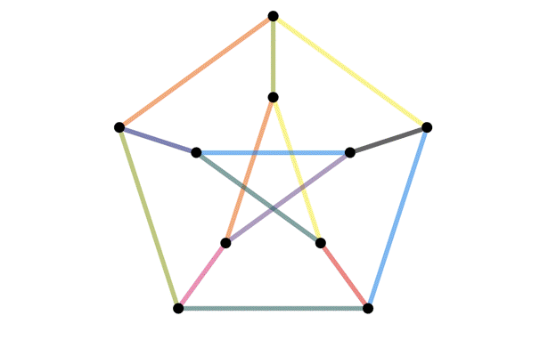

<!-- Gif -->

  

<!-- Título do Repô -->
<h1 align="center">
  Grafos em Kotlin
</h1>

<!-- Badge da Linguagem -->

    

<!-- Screenshot -->

  

<!-- Subtítulo -->
<h5 align="center"> 
  Meus códigos e algoritmos relacionados à Grafos feitos utilizando:
</h5>

<!-- Logo da Linguagem -->

    

